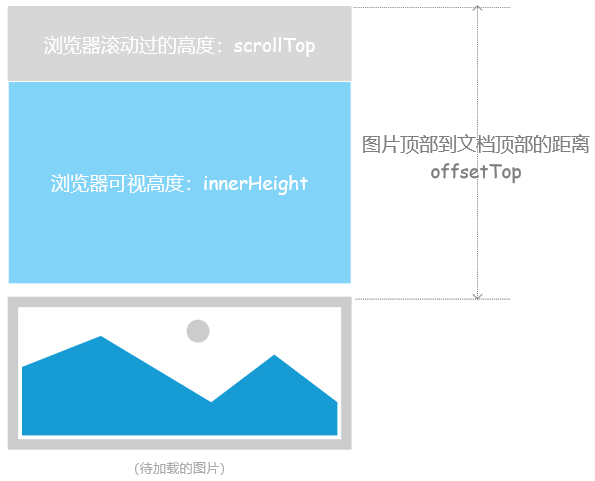
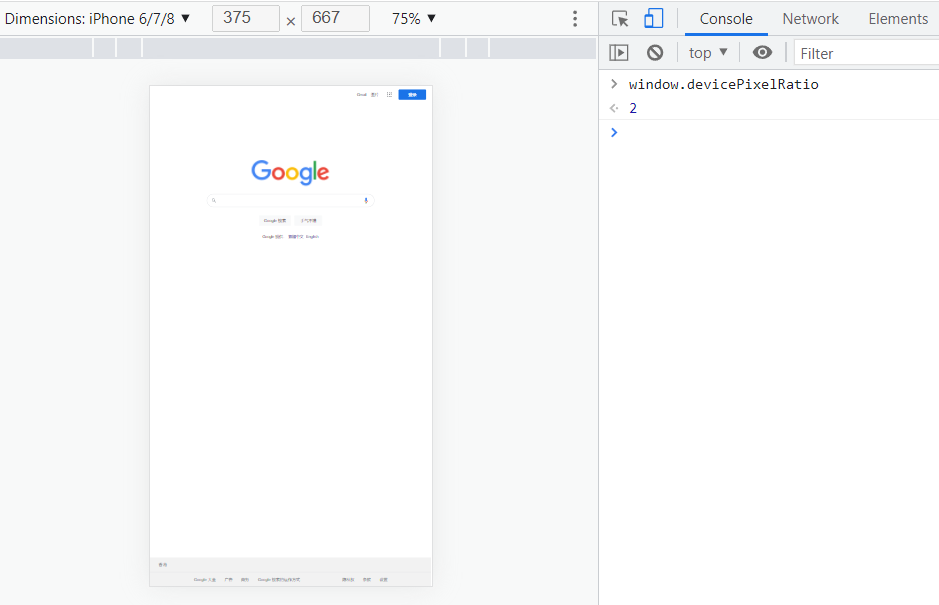

### 001：简述什么事BFC？

1. 基本概念：**B**lock **F**ormatting **C**ontext，块级格式化上下文

   它是一个独立的布局环境，其中的元素布局不会影响到外界元素； 

2. 解决什么问题？

   - 清除浮动；
   - 避免margin重叠；
   - 创建独立的布局上下文；

3. 满足以下条件，就可以创建BFC

   - 浮动元素：`!none`
   - 绝对定位元素：`absolute/fixed`
   - display：`inline-block/table-cell/flex/grid` 
   - overflow：`!visible `

### 002：px/em/rem

px、rem、em都是用来表示长度或字体大小的单位，它们之间的主要区别在于相对性和继承性：

- `px`：固定单位，相对于 **显示器屏幕分辨率** 而言，值是固定的，指定多少就是多少。
- `em`：相对单位，相对于 **父元素** 字体大小，em单位的值可以被子元素继承。
  - em = 像素值 / 父元素字体大小
- `rem`：相对单位，相对于 **根元素** 字体大小，rem单位的值不会被继承。
  - 根元素字体大小 = 设备宽度/设计稿宽度 * 100
  - rem = 设计稿值 / 100

### 003：谈一谈盒子模型

1. 组成：content - padding - border -margin
2. 标准盒子模型
3. IE盒子模型

### 004：CSS3有哪些新特性？

媒体查询/文本阴影/渐变/圆角/盒子阴影/过渡/动画/变形转换/弹性布局/网格布局/视口单位

### 005：link 与 @import 的区别？

1. `<link>` 可以在 HTML 文档中引入 CSS 文件，而 `@import` 只能在 CSS 文件中引入其他 CSS 文件。
2. `<link>` 在页面加载时同时加载 CSS 文件，而 `@import` 会在页面加载完成后才加载。
3. `<link>` 可以通过其属性指定不同的媒体类型、字符集等参数，而 `@import` 没有这些选项。
4. `<link>` 可以通过 JavaScript 动态地创建和删除，而 `@import` 不支持这种操作。

### 006：什么是外边距重叠？ 重叠的结果是什么？

外边距重叠是指两个或多个相邻元素的外边距（margin）发生重叠的现象。

折叠结果遵循下列计算规则：

1. 两个相邻的外边距都是正数时，折叠结果是它们两者之间较大的值
2. 两个相邻的外边距都是负数时，折叠结果是两者绝对值的较大值
3. 两个外边距一正一负时，折叠结果是两者的相加的和 

### 007：`flex：0 1 auto` 是什么意思？

flex是 【flex-grow】【flex-shrink】【flex-basis】3个 属性的缩写

- flex-grow：定义项目放大比例
  - 默认为0，表示如果存在剩余空间，也不放大，都为1时表示平均分配剩余空间；
- flex-shrink：定义项目缩小比例
  - 默认值为1，即如果空间不足，该项目将等比缩小；
- flex-basis：用于设置项目占据的主轴空间
  - 设置为auto表示项目占据的主轴大小等于项目的实际内容大小
  - 设置为固定值表示项目占据的主轴大小等于固定值  

### 008：解释什么是浮动以及工作原理？

1. 概念："浮动"是一种CSS属性，用于控制HTML元素在容器中的位置。浮动元素会从文档流中移除，并且尽可能地靠近其容器的左侧或右侧。
2. 工作原理
   - 浮动元素脱离文档流，不占据空间（引起“高度塌陷”现象）
   - 浮动元素碰到包含它的边框或者其他浮动元素的边框停留  
3. 引起的问题
   - 父元素的高度无法被撑开，影响与父元素同级的元素
   - 与浮动元素同级的非浮动元素会跟随其后  
4. 清除浮动
   - 给父元素设置固定的高度（缺点是只有已知子元素高度才能设置）；
   - 添加额外标签，例如 \<div style="clear:both">\</div>;
   - 使用after伪元素（由于IE6-7不支持 :after，使用 zoom:1 触发 hasLayout） ;

### 009：如何实现三蓝布局

1. flex布局：中间元素 flex-grow:1；
2. float浮动布局：中间元素的左右margin为左右元素的宽度；
3. absolute绝对布局：同上；
4. table布局：父：display：table，子：display：table-cell;  

### 010：如何实现元素居中？

1. 弹性盒模型；
2. 绝对定位 + margin:
3. 绝对定位 + 平移：transform：translate（-50%，-50%）;
4. line-height 和 height 保持一致（里面的元素必须是inline，否则不生效）；
5. 通过padding：（已知子元素宽高情况，但不推荐）； 

### 011：CSS选择器及其优先级

| 选择器         | 格式                   | 优先级权重 |
| -------------- | ---------------------- | ---------- |
| `id` 选择器    | `#id`                  | 100        |
| 类选择器       | `#classname`           | 10         |
| 属性选择器     | `input[type='button']` | 10         |
| 伪类选择器     | `li:last-child`        | 10         |
| 标签选择器     | `div`                  | 1          |
| 伪元素选择器   | `li:after`             | 1          |
| 相邻兄弟选择器 | `h1 + p`               | 0          |
| 子选择器       | `ul > li`              | 0          |
| 后代选择器     | `li a`                 | 0          |
| 通配符选择器   | `*`                    | 0          |

对于选择器的 **优先级**：

- 标签选择器、伪元素选择器：`1`

- 类选择器、伪类选择器、属性选择器：`10`
- `id` 选择器：`100`
- 内联样式：`1000`

**注意事项：**

- `!important` 声明的样式的优先级最高；
- 如果优先级相同，则最后出现的样式生效；
- 继承得到的样式的优先级最低；
- 通用选择器（`*`）、子选择器（`>`）和相邻同胞选择器（`+`）并不在这四个等级中，所以它们的权值都为 `0` ；
- 样式表的来源不同时，优先级顺序为：内联样式 > 内部样式 > 外部样式 > 浏览器用户自定义样式 > 浏览器默认样式。

### 012：CSS 中可继承与不可继承属性有哪些？

**（1）继承属性**

- <u>字体</u> 系列属性：`font-family`、`font-weight`、`font-size`、`font-style`
- <u>文本</u> 系列属性：`text-indent`、`text-align`、`line-height`、`word-spacing`、`letter-spacing`、`text-transform`、`color`
- 元素可见性：`visibility`
- 列表布局属性：`list-style-type`、`ist-style-image` 等
- 光标属性：`cursor`

**（2）非继承属性**

- `display`
- 文本属性：`vertical-align`、`text-decoration`、`text-shadow`、`white-space`
- 盒子模型相关属性
- 背景属性
- 定位属性
- 轮廓样式属性
- ...

### 013：隐藏元素的方法有哪些？

- `display: none`：渲染树不会包含该渲染对象，因此该元素不会在页面中占据位置，也不会响应绑定的监听事件
- `visibility: hidden`：元素在页面中仍占据空间，但是不会响应绑定的监听事件。
- `opacity: 0`：将元素的透明度设置为 0，以此来实现元素的隐藏。元素在页面中仍然占据空间，并且能够响应元素绑定的监听事件。
- `position: absolute`：通过使用绝对定位将元素移除可视区域内，以此来实现元素的隐藏。
- `z-index: 负值`：使其他元素遮盖住该元素，以此来实现隐藏。
- `clip/clip-path`：使用元素裁剪的方法来实现元素的隐藏，这种方法下，元素仍在页面中占据位置，但是不会响应绑定的监听事件。
- `transform: scale(0, 0)`：将元素缩放为 0，来实现元素的隐藏。这种方法下，元素仍在页面中占据位置，但是不会响应绑定的监听事件。

### 014：伪元素和伪类的区别和作用？

- **伪元素**：在内容元素的前后插入额外的元素或样式，但是这些元素实际上并不在文档中生成。它们只在外部显示可见，但不会在文档的源代码中找到它们，因此，称为 “伪” 元素。例如：`::before`、`::after`、`::first-line`、`::first-letter`
- **伪类**：将 <u>特殊的效果</u> 添加到 <u>特定选择器</u>上。它是已有元素上添加类别的，不会产生新的元素。例如：`:hover`、`:first-child`

> **总结**： 伪类是通过在元素选择器上加⼊伪类改变元素状态，⽽伪元素通过对元素的操作进⾏对元素的改变。

### 015：CSS 优化和提高性能的方法有哪些？

（1）合并、压缩（GZIP）

（2）选择器优化嵌套，尽量避免层级过深

（3）避免使用通配符 `*` 、后代选择器（CSS选择器是从右到左进行匹配的）、CSS 表达式

（4）巧妙使用 CSS 继承机制

（5）拆分公共样式

（6）cssSprite

（7）避免使用 `@import`，建议使用 `link`

（8）如果使用了 `id` 选择器，就不需再加其他规则，因为 `id` 是唯一的

（9）属性值为0时，不加单位；属性值为浮动小数 `0.xx` 时，省略小数点前的 `0`

（10）去除无用的样式及空规则；

（11）慎重使用高性能属性：浮动、定位

（12）尽量减少页面重排、重绘

（13）标准化各种浏览器前缀：带浏览器前缀的在前。标准属性在后。

### 016：如何判断元素是否到达可视区域？

以图片显示为例：



- `window.innerHeight` 是浏览器可视区的高度；

- `document.body.scrollTop || document.documentElement.scrollTop` 是浏览器滚动过的距离；
- `imgs.offsetTop` 是元素顶部距离文档顶部的高度（包括滚动条的距离）；
- 内容达到显示区域的：`img.offsetTop < window.innerHeight + document.body.scrollTop;`

### 017：如何解决 1px 问题？

1px 问题指的是：在一些  Retina屏幕 的机型上，移动端页面的 1px 会变得很粗，呈现出不止 1px 的效果。原因很简单——CSS 中的 1px 并不能和移动设备上的 1px 划等号。它们之间的比例关系有一个专门的属性来描述：

```js
window.devicePixelRatio = 设备的物理像素 / CSS像素。
```

打开 Chrome 浏览器，启动移动端调试模式，在控制台去输出这个 `devicePixelRatio` 的值。这里选中 iPhone6/7/8 这系列的机型，输出的结果就是2：



这就意味着设置的 1px CSS 像素，在这个设备上实际会用 2 个物理像素单元来进行渲染，所以实际看到的一定会比 1px 粗一些。 **解决1px 问题的三种思路：**

#### 思路一：直接写 0.5px

```vue
<div id="container" :data-device="window.devicePixelRatio"></div>
```

```css
#container[data-device="2"] {
  border:0.5px solid #333
}
```

#### 思路二：伪元素先放大后缩小（*）

这个方法的可行性会更高，兼容性也更好。唯一的缺点是代码会变多。

思路：**先放大、后缩小**

在目标元素的后面追加一个 `::after` 伪元素，让这个元素布局为 `absolute` 之后、整个伸展开铺在目标元素上，然后把它的宽和高都设置为目标元素的两倍，`border` 值设为 `1px`。接着借助 CSS 动画特效中的放缩能力，把整个伪元素缩小为原来的 `50%`。此时，伪元素的宽高刚好可以和原有的目标元素对齐，而 `border` 也缩小为了 `1px` 的二分之一，间接地实现了 `0.5px` 的效果。

代码如下：

```css
#container[data-device='2'] {
  position: relative;
}
#container[data-device='2']::after {
  content: '';
  position: absolute;
  top: 0;
  left: 0;
  width: 200%;
  height: 200%;
  transform: scale(0.5);
  transform-origin: left top;
  box-sizing: border-box;
  border: 1px solid #333;
}
```

#### 思路三：viewport 缩放

这个思路就是对 meta 标签里几个关键属性下手：

```html
<meta name="viewport" content="initial-scale=0.5, maximum-scale=0.5, minimum-scale=0.5, user-scalable=no">
```

这里针对像素比为2的页面，把整个页面缩放为了原来的1/2大小。这样，本来占用2个物理像素的 1px 样式，现在占用的就是标准的一个物理像素。根据像素比的不同，这个缩放比例可以被计算为不同的值，用 js 代码实现如下：

```javascript
const scale = 1 / window.devicePixelRatio;
// 这里 metaEl 指的是 meta 标签对应的 Dom
const value = `width=device-width,user-scalable=no,initial-scale=${scale},maximum-scale=${scale},minimum-scale=${scale}`;
metaEl.setAttribute('content', value);
```

这样解决了，但这样做的副作用也很大，整个页面被缩放了。这时 1px 已经被处理成物理像素大小，这样的大小在手机上显示边框很合适。但是，一些原本不需要被缩小的内容，比如文字、图片等，也被无差别缩小掉了。

### 018：如何设置小于12px的字体？

在谷歌下css设置字体大小为12px及以下时，显示都是一样大小，都是默认12px。

**解决办法：**

- 使用Webkit的内核的 `-webkit-text-size-adjust:none` 的私有CSS属性来解决（高版本不兼容）;
- 使用 CSS3 中的 `transform:scale(.xx)` 解决；
- 使用图片：如果是内容固定不变情况下，使用将小于12px文字内容切出做图片，这样不影响兼容也不影响美观。

### 019：对 sticky 定位的理解？

sticky 英文字面意思是粘贴，所以可以把它称之为粘性定位。语法：`position: sticky;`  基于用户的 **滚动位置** 来定位。

粘性定位的元素是依赖于用户的滚动，在 `position:relative` 与 `position:fixed` 定位之间切换。它的行为就像 `position:relative;` 而当页面滚动超出目标区域时，它的表现就像 `position:fixed;`，它会固定在目标位置。元素定位表现为在跨越特定阈值前为相对定位，之后为固定定位。这个特定阈值指的是 `top`, `right`, `bottom` 或 `left` 之一，换言之，指定 `top`, `right`, `bottom` 或 `left` 四个阈值其中之一，才可使粘性定位生效。否则其行为与相对定位相同。

### 020：absolute 与 fixed 共同点与不同点？

**共同点：**

- 隐式改变行内元素的呈现方式，将 `display` 置为 `inline-block` 
- 使元素脱离普通文档流，不再占据文档物理空间
- 覆盖非定位文档元素

**不同点：**

- `abuselute` 与 `fixed` 的根元素不同，`abuselute` 的根元素可以设置，`fixed` 根元素是浏览器。
- 在有滚动条的页面中，`absolute` 会跟着父元素进行移动，`fixed` 固定在页面的具体位置。


